# Verity — MVP para Shipaton 2026

App móvil que sella **fotos y videos** con una huella digital (SHA-256)
calculada en el dispositivo y la registra en un registro público
(Polygon Amoy, testnet) — sin subir el archivo original a ningún lado.

Construida para el hackathon [Shipaton 2026](https://www.shipaton.com/) de
RevenueCat. Ver el contexto completo del protocolo (fuera de alcance para
este MVP) en [`reference/VERITY_VRT_Documento_Maestro_v1.1.pdf`](reference/VERITY_VRT_Documento_Maestro_v1.1.pdf).

**Versión actual: 0.3.26.** Ver "Versionado" más abajo para el esquema
que se sigue de acá en adelante.

## Estructura del proyecto

```
VERITY/
├── app/                    # Código de la app móvil (Expo + TypeScript)
│   ├── screens/             # Pantallas: Sellar, Mis sellos, Verificar, Onboarding
│   ├── components/          # Componentes reutilizables (tarjetas, modales, sello, paywall...)
│   ├── services/             # Hash, blockchain, RevenueCat, índice público
│   ├── utils/                 # Historial local, respaldo, recorrido guiado
│   └── App.tsx
├── backend/                 # Índice público (Supabase) — ver backend/README.md
├── docs/                      # Página pública de verificación (GitHub Pages)
├── assets/                    # Icono y screenshots para Google Play
├── documentation/
│   ├── technical/verity-protocol.ts   # Definición técnica del MVP
│   └── shipaton-submission/            # Materiales para Devpost
└── reference/                # Documento maestro y web informativa (NO se implementan tal cual)
```

## Cómo probar la app

```bash
npm install
npm start
```

Esto abre Expo Dev Tools; escanea el QR con la app **Expo Go** en tu
teléfono Android, o presiona `a` para abrir un emulador Android.

Antes de sellar de verdad necesitas:

1. Copiar `.env.example` a `.env` (el RPC de Polygon Amoy por defecto ya
   funciona sin más cambios; solo completa `EXPO_PUBLIC_REVENUECAT_ANDROID_KEY`
   cuando tengas cuenta de RevenueCat — ver "Freemium y pagos" abajo).
2. Nada más — la wallet del dispositivo consigue su propio POL de
   prueba sola, en silencio, la primera vez que hace falta (ver "Gas
   automático para wallets nuevas" más abajo). Ya no hace falta ir a
   ningún faucet a mano.

⚠️ Importante: probado tanto en **Expo Go** como en un build real de
EAS (APK instalable). Un módulo nativo (`expo-media-library`, para
guardar las capturas en la galería del sistema — ver "Qué SÍ incluye
este MVP") solo funciona confiablemente en un build real; en Expo Go
puede no pedir el permiso correcto, así que esa copia adicional puede
fallar en silencio ahí sin afectar el sellado en sí (la copia interna
de Verity, que es la que usa la app, siempre funciona en ambos).

## Qué SÍ incluye este MVP

- **Sella fotos Y videos**: cámara (foto o video, cada uno en su propio
  modo para evitar el gesto ambiguo de "mantener presionado" que falla
  en algunas cámaras nativas) o galería → hash SHA-256 local → registro
  en Polygon Amoy → certificado. Para video se extrae además un frame
  real como vista previa (`expo-video-thumbnails`) y se puede reproducir
  de verdad (controles nativos) tocando la carta del certificado.
- Nivel de confianza simplificado: ALTO / MEDIO / BAJO, calculado por
  origen del archivo y metadatos disponibles (ver
  [`documentation/technical/verity-protocol.ts`](documentation/technical/verity-protocol.ts)) —
  con una aclaración explícita en la propia app de que esto NO evalúa si
  el contenido es real o falso, solo cuánta evidencia de origen hay.
- Historial local de sellos (sin cuenta, sin servidor): lista o grilla,
  con una tarjeta de estadísticas (total + desglose por confianza), y
  detalle completo dentro de la app — incluye deslizar entre
  certificados y voltear la carta (animación de "giro de moneda") para
  ver la foto/video real o, si no hay archivo local, un sello
  (`SealMedallion`) que confirma que el certificado sigue siendo válido.
- Número de sello con secuencia real (`#A00001`, `#A00002`...): el
  orden en que se selló cada archivo en ese teléfono — no un dato
  decorativo, sirve para nombrar/ordenar archivos propios.
- Detección de duplicados: si sellas el mismo archivo dos veces, Verity
  te muestra el certificado existente en vez de anclar (y cobrar gas) de
  nuevo.
- Copia de seguridad exportable/importable del historial local, y
  **respaldo/restauración de la wallet del dispositivo** (ver sección
  "Respaldo y recuperación" abajo — sin esto, borrar los datos de la
  app pierde la identidad con la que se selló para siempre).
- **Sellado en lote (solo PRO)**: elegir varias fotos/videos de golpe
  en Galería — se sellan uno por uno en segundo plano (nunca en
  paralelo, para no chocar el nonce de la wallet) con una barra de
  progreso general, y un resumen al final (cuántos se sellaron,
  cuántos ya estaban repetidos). El plan gratis sigue siendo uno a la
  vez, como siempre.
- Freemium con RevenueCat conectado de verdad (ver "Freemium y pagos").
- Splash screen animado, onboarding de 4 pantallas (incluye el plan
  gratis/PRO), y un recorrido guiado (coach marks) que resalta los
  controles principales de cada pestaña la primera vez que se visita.
- Diseño con una sola identidad visual (ver `app/theme/`): modo Claro,
  Oscuro y Sistema, seleccionable desde Ajustes en cualquiera de las 3
  pantallas. Sección legal real en Ajustes: Política de privacidad,
  Términos de uso, FAQ y "Modo de uso" — no texto de relleno genérico.
- **Ícono real de la app**: monograma "VRT" en el azul de acento de la
  app (`#4C9AFF`) sobre el negro base del modo oscuro (`#0B0B0F`) —
  antes era blanco sobre negro, sin ningún color de marca; ahora el
  mismo azul que se ve en botones, links e insignias en toda la app
  también está en el ícono. Incluye ícono adaptativo de Android
  (`adaptive-icon-foreground.png`) para que se vea bien recortado en
  círculo, cuadrado redondeado, etc. según el launcher del teléfono.
- **Índice público de verificación** (`backend/`, Supabase): "Verificar"
  ahora encuentra un archivo sellado desde OTRO dispositivo por su
  huella digital, sin necesitar el número de sello a mano — más una
  página web (`docs/index.html`) para verificar sin instalar la app.
  Ver "Backend e índice público" más abajo.
- **Guardado real en la galería del sistema** (`expo-media-library`):
  una foto o video sellado con la cámara de Verity ahora también se
  guarda en la galería normal del teléfono, no solo en la carpeta
  privada de la app. Sin esto, "Verificar → Elegir de mi galería"
  nunca podía encontrar algo sellado con la cámara — el archivo
  simplemente no existía ahí. Solo se pide permiso de "agregar", no de
  leer el resto de la galería. Requiere un build real (no funciona
  confiablemente en Expo Go).

## Capturas de pantalla

Probadas en dispositivo Android real (Expo Go), modo claro y oscuro.
El botón circular gris flotante que aparece en algunas capturas
**no es parte de la app** — es el propio botón de Expo Go para abrir
su menú de desarrollador durante las pruebas; no existe en un build
real.

<table>
<tr>
<td width="33%">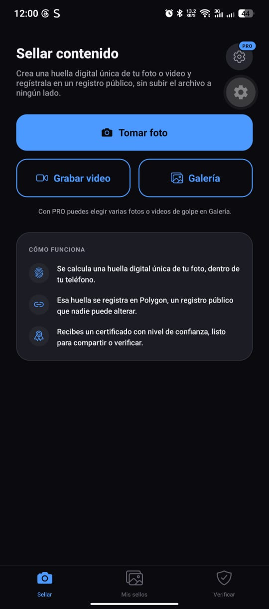<br/><sub><b>Sellar</b> — modo oscuro</sub></td>
<td width="33%">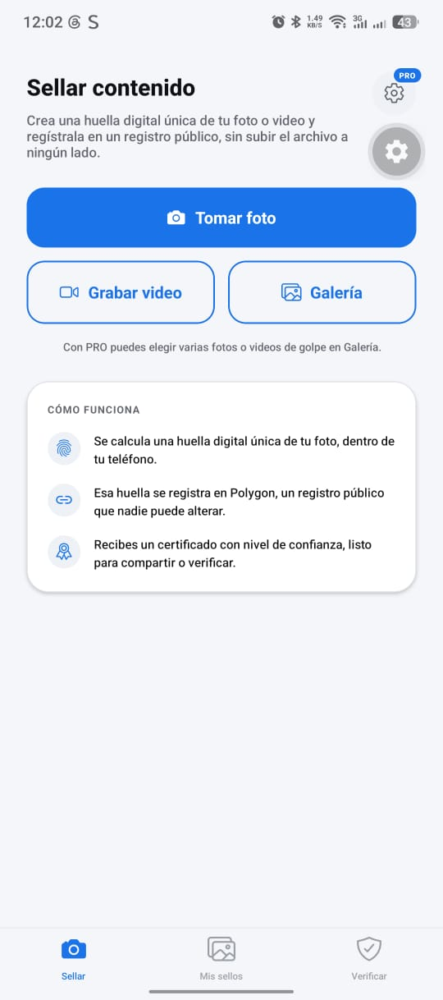<br/><sub><b>Sellar</b> — modo claro</sub></td>
<td width="33%">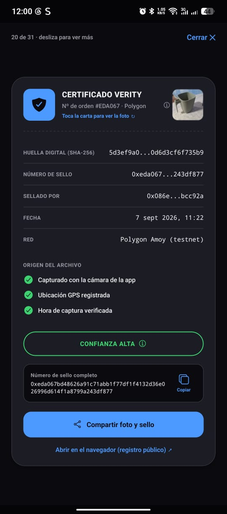<br/><sub>Detalle de certificado, con nivel de confianza y evidencia de origen</sub></td>
</tr>
<tr>
<td width="33%">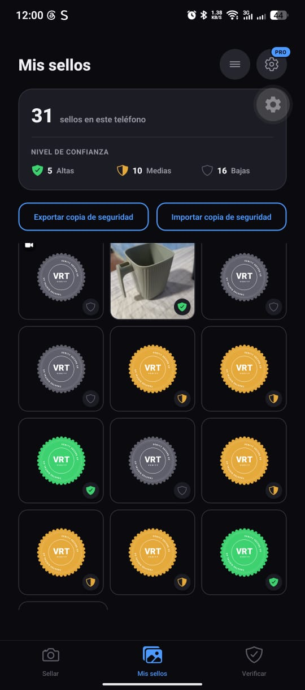<br/><sub><b>Mis sellos</b> — grilla, con el sello (SealMedallion) para certificados sin archivo local</sub></td>
<td width="33%">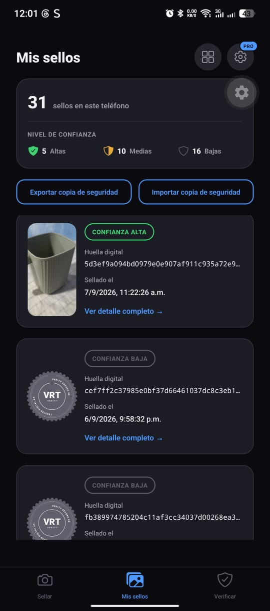<br/><sub><b>Mis sellos</b> — lista, con estadísticas por nivel de confianza</sub></td>
<td width="33%">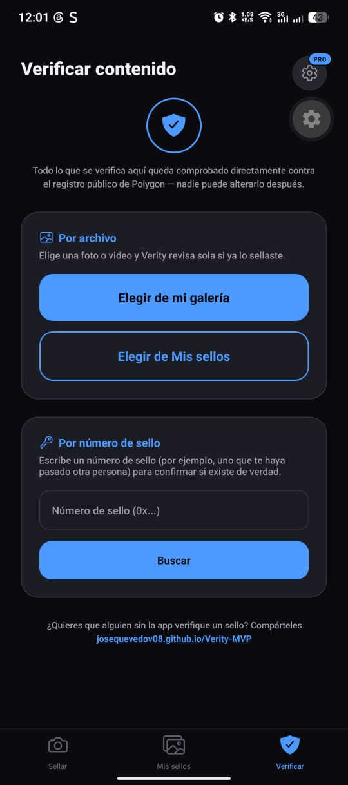<br/><sub><b>Verificar</b> — modo oscuro, con el enlace a la web pública</sub></td>
</tr>
<tr>
<td width="33%">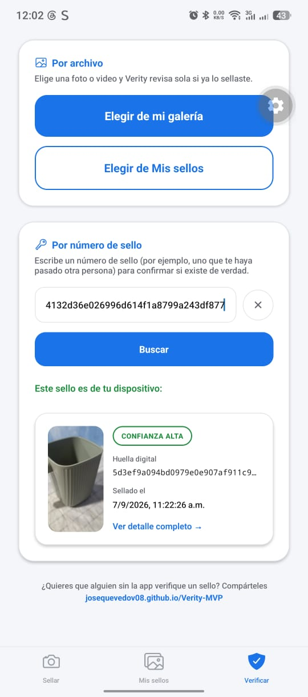<br/><sub><b>Verificar</b> — modo claro, resultado por número de sello</sub></td>
<td width="33%">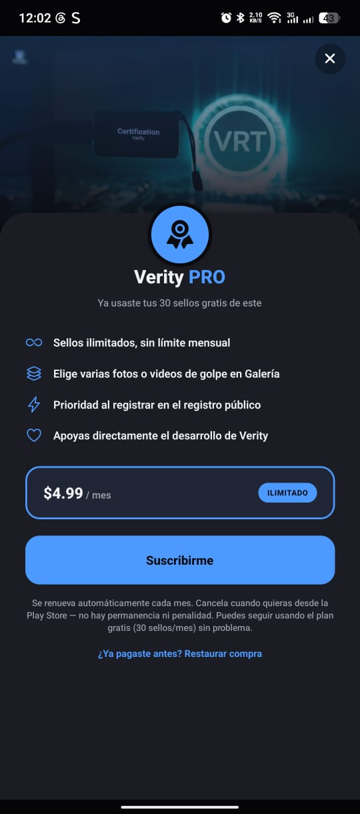<br/><sub>Paywall de <b>Verity PRO</b></sub></td>
<td width="33%">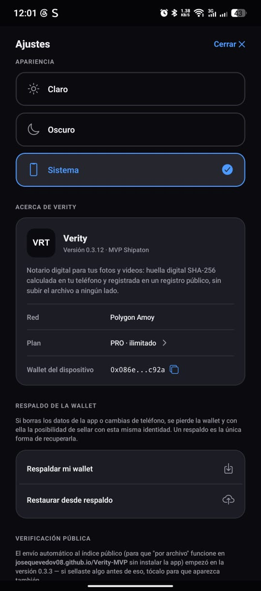<br/><sub><b>Ajustes</b> — apariencia y "Acerca de Verity"</sub></td>
</tr>
<tr>
<td width="33%">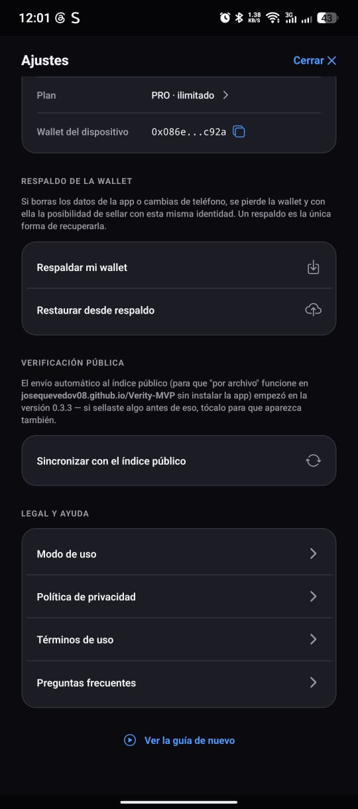<br/><sub><b>Ajustes</b> — respaldo de wallet, sincronizar índice público, legal</sub></td>
<td width="33%">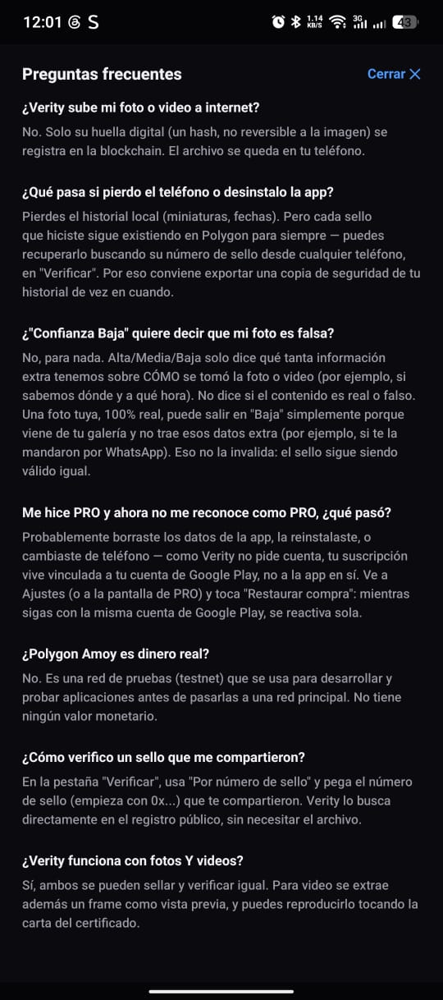<br/><sub>Preguntas frecuentes — sección legal real, no texto de relleno</sub></td>
<td width="33%">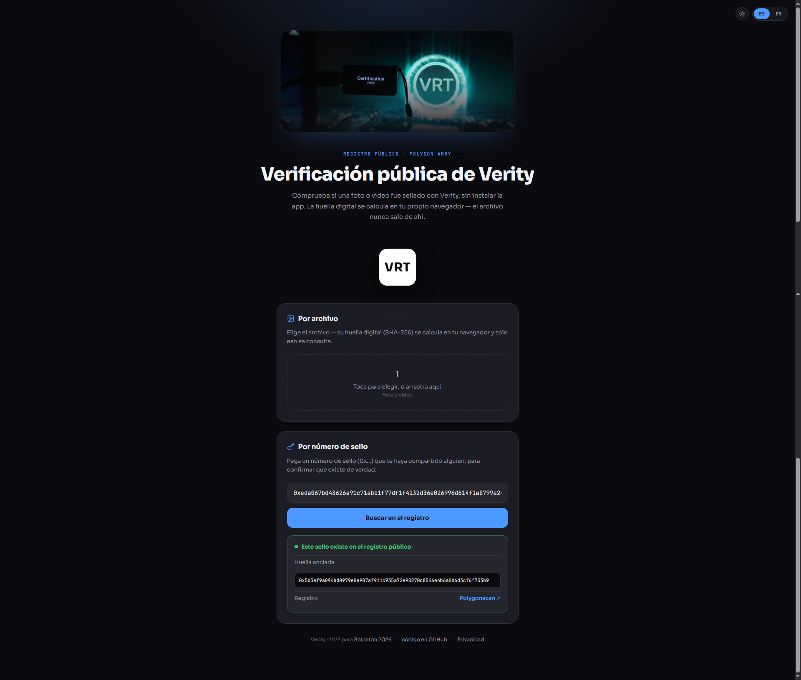<br/><sub><b>Página web pública</b> — <a href="https://josequevedov08.github.io/Verity-MVP/">josequevedov08.github.io/Verity-MVP</a></sub></td>
</tr>
</table>

## Freemium y pagos

- Gratis: 30 sellos/mes. PRO: $4.99/mes, ilimitado.
- El límite y el paywall (`PaywallModal.tsx`) están conectados de
  verdad — antes de sellar se revisa el uso del mes, y al llegar al
  límite se bloquea con el paywall en vez de dejar sellar gratis sin
  tope.
- **Lo que falta para cobrar de verdad**: un producto de suscripción
  real dado de alta en Google Play Console (requiere el registro de
  desarrollador, $25 pago único — deliberadamente pospuesto a la fase
  de publicación). Hasta entonces, tocar "Suscribirme" avisa
  honestamente que no está disponible todavía, en vez de fallar en
  silencio o simular una compra.
- **Restaurar compra**: como Verity no pide cuenta, la suscripción se
  identifica con un ID vinculado a la cuenta de Google Play del
  dispositivo — si se borran los datos de la app o se reinstala, ese ID
  se pierde. El botón "Restaurar compra" (Ajustes y en el paywall) le
  pregunta directo a Google Play si esa cuenta ya pagó, y reactiva el
  PRO — funciona mientras sea la misma cuenta de Google Play, igual que
  en Spotify/Netflix/etc. Documentado en Términos de uso y FAQ dentro
  de la app.

## Qué NO incluye (a propósito)

Detección de IA, wallet visible, multi-chain, login, y el token VRT. Ver
el prompt de proyecto en `documentation/` para el detalle de por qué.
También se evaluó y se descartó por ahora:

- **Sellado automático desde la cámara nativa del sistema** (sin abrir
  Verity): técnicamente posible con un servicio en segundo plano
  vigilando la galería, pero requeriría salir de Expo Go (development
  build) y — más importante — debilitaría la garantía de nivel ALTO,
  porque ya no habría certeza de que el archivo no fue editado entre el
  momento de la captura real y el momento en que Verity lo detecta.

## Respaldo y recuperación (qué pasa si pierdes el teléfono)

El sello en sí (la transacción en Polygon Amoy) es permanente y no
depende del teléfono. Lo que SÍ vive solo en el dispositivo es el índice
local (miniaturas, fechas, saber qué ya sellaste) y la wallet que
identifica esos sellos como tuyos.

Mitigaciones implementadas, ambas en "Mis sellos" / Ajustes:

- **Historial**: exportar/importar un `.json` con hashes, números de
  sello y metadatos (nunca la foto ni una miniatura — Verity no sube ni
  guarda el archivo original en ningún respaldo, a propósito). El
  respaldo por sí solo no prueba autoría de una foto, solo restaura tu
  propio índice de "qué sellé y cuándo".
- **Wallet**: "Respaldar mi wallet" (Ajustes) exporta la clave privada
  del dispositivo a un archivo — tan sensible como una contraseña, con
  advertencia explícita — y "Restaurar desde respaldo" la reinstala en
  un teléfono nuevo. Sin esto, borrar los datos de la app pierde para
  siempre la identidad con la que se selló (le pasó a un usuario real
  en pruebas).

"Verificar" no requiere pegar el número de sello antes de elegir el
archivo: el flujo es al revés — eliges la foto/video primero, Verity la
hashea y busca sola, primero en el historial local de este dispositivo
y, si no está ahí, en el **índice público** (ver "Backend e índice
público" abajo) por si se selló desde OTRO dispositivo. Solo si tampoco
aparece ahí hace falta escribir el número de sello a mano.

## ⚠️ Corrección importante: el hash SHA-256 (v0.3.6)

Hasta la v0.3.5, `hashService.ts` calculaba el hash sobre el **texto
base64** del archivo (`Crypto.digestStringAsync` opera sobre strings),
no sobre sus bytes reales — un bug real, no una decisión de diseño.
El valor resultante era consistente *dentro* de Verity (por eso
duplicados y "por número de sello" seguían funcionando), pero **no
era un SHA-256 estándar del archivo**: ninguna herramienta externa
(la página pública de verificación, `sha256sum`, etc.) podía
reconocerlo, sin importar qué copia exacta del archivo se usara.

Corregido en 0.3.6: ahora se leen los bytes crudos
(`file.arrayBuffer()`) y se hashean con `Crypto.digest()` (la API de
expo-crypto que opera sobre bytes, equivalente a
`crypto.subtle.digest()` del navegador) — el mismo resultado que
cualquier herramienta estándar calcularía. **Cualquier certificado
sellado antes de la 0.3.6 no se puede verificar "por archivo"** (ni
en la web ni por ninguna herramienta externa) porque su hash nunca
fue el hash real del archivo — sigue siendo válido dentro de la app
(historial local, número de sello), pero no cruza esa frontera. Los
certificados sellados desde la 0.3.6 en adelante sí son 100%
verificables externamente.

## Casos reales: qué prueba Verity, qué no, y de qué no es responsable

Pregunta real del usuario que motivó esta sección: *"si hubiera un
caso ante un juez y 3 personas dicen que un mismo sello es suyo, ¿a
quién le cree? ¿cómo se determina de quién es la foto real?"* — la
respuesta corta es que Verity prueba una cosa muy específica (que un
archivo exacto existía, sellado por una wallet exacta, en un momento
exacto) y **no** prueba otra que la gente tiende a asumir que sí
prueba (quién es la persona real detrás de esa wallet). Mejor
explicarlo con casos concretos que con un párrafo legal abstracto:

**Caso 1 — Disputa de autoría ("ese sello es mío", dicen 3 personas)**
- *Verity SÍ aporta:* qué wallet ancló ese hash y cuándo. Quien pueda
  restaurar la clave privada de esa wallet (ver "Respaldo de la
  wallet" abajo) y firmar un reto nuevo que un perito verifique contra
  esa misma dirección, demuestra que la controla — igual que probar
  que una billetera cripto es tuya.
- *Verity NO resuelve:* que esa wallet sea de una persona real
  específica. Es anónima por diseño (sin login) — Verity no vincula
  "esta wallet" con "este nombre y cédula". Un juez necesitaría
  evidencia adicional (testigos, peritaje del dispositivo, quién tenía
  el teléfono) para dar ese salto.
- *Responsabilidad:* Verity certifica un hecho técnico, no arbitra
  quién dice la verdad. No es un servicio de identidad ni reemplaza un
  peritaje.

**Caso 2 — Reclamo de seguro (foto de un daño para probar la fecha)**
- *Verity SÍ aporta:* fecha y hora exactas de cuándo se selló, y el
  nivel de confianza (Alta si se tomó con la cámara de la app, con GPS
  y hora del dispositivo verificados).
- *Verity NO prueba:* la causa del daño ni el relato de los hechos —
  solo que ESA foto exacta existía en ese momento, no falla cómo pasó
  lo que muestra.
- *Responsabilidad:* la aseguradora decide si acepta la evidencia
  como parte de su proceso — Verity no arbitra reclamos.

**Caso 3 — Subir una foto vieja de la galería (Confianza Baja)**
- *Verity SÍ aporta:* prueba que el archivo se registró en el momento
  en que lo sellaste — no antes.
- *Verity NO prueba:* cuándo se TOMÓ la foto originalmente. Si subes
  una foto de hace 3 años desde tu galería, Verity certifica el
  momento del SELLADO, no el de la captura real — por eso queda en
  confianza más baja, no porque se sospeche que es falsa.

**Caso 4 — Pérdida o robo del teléfono**
- *Verity SÍ aporta:* la wallet vive protegida en el Keystore/Keychain
  del sistema operativo, no en un archivo suelto fácil de copiar.
- *Verity NO puede evitar:* que alguien con acceso físico y
  desbloqueado al teléfono abra la app y selle algo "como si fuera" el
  dueño original — igual que pasa con cualquier billetera cripto o app
  bancaria sin bloqueo propio.
- *Responsabilidad:* proteger el teléfono (bloqueo de pantalla,
  respaldo de la wallet) es responsabilidad de quien lo usa, no algo
  que Verity pueda garantizar desde el software.

**Caso 5 — Contenido generado por IA, sellado apenas se crea**
- *Verity SÍ aporta:* prueba que ESE archivo (con ESE hash exacto)
  existía desde el momento del sellado, y que nadie lo alteró después.
- *Verity NO detecta:* si el contenido en sí es real o generado por
  IA. El nivel de confianza mide el ORIGEN (metadatos de captura), no
  analiza los píxeles para detectar manipulación o generación
  sintética. Si alguien crea una imagen falsa y la sella al instante,
  Verity certificaría honestamente que "este archivo (que resulta ser
  una imagen generada por IA) existía desde tal fecha" — no que sea
  real. Esto es intencional: la detección de contenido generado por IA
  quedó fuera de alcance de este MVP (ver "Qué NO incluye" arriba).

**En una frase:** Verity es un notario de *integridad y momento en el
tiempo* de un archivo — no un detector de mentiras, ni un verificador
de identidad, ni un árbitro de disputas. Certifica *qué* existía y
*cuándo*, no *quién* lo hizo ni *si* lo que muestra es cierto.

## Backend e índice público

`backend/` (Supabase, proyecto `verity-mvp`) guarda un índice público
**de solo metadatos** — hash, número de sello, tx de anclaje, nivel de
confianza, tipo de medio — nunca el archivo original. Existe para UNA
sola cosa: que "Verificar" encuentre un archivo sellado desde OTRO
dispositivo por su huella digital, sin necesitar el número de sello a
mano. Si este índice desapareciera, ningún sello dejaría de ser válido
— la verdad sigue viviendo en Polygon; esto solo hace más fácil
encontrarla. Ver [`backend/README.md`](backend/README.md) para el
detalle completo (por qué la escritura pasa por una Edge Function que
verifica el anclaje real en la cadena antes de aceptar nada, en vez de
un insert directo).

También existe [`docs/index.html`](docs/index.html): una página
pública de verificación sin instalar la app, publicada en
[josequevedov08.github.io/Verity-MVP](https://josequevedov08.github.io/Verity-MVP/)
vía GitHub Pages — calcula la huella digital en el propio navegador y
consulta lo mismo que la app. Bilingüe (ES/EN, detecta el idioma del
navegador) y con modo claro/oscuro real (el sello flotante se invierte
solo según el tema), más un aviso de privacidad explicando qué hace y
qué no hace la página (no usa cookies ni analítica).

### Gas automático para wallets nuevas (v0.3.19)

La wallet del dispositivo (ver "Respaldo y recuperación" arriba) necesita
una pequeñísima cantidad de POL de prueba para pagar el gas de cada
anclaje. Sin nada más, un usuario que instala Verity de cero tendría que
salir de la app a un faucet externo, copiar su dirección a mano y resolver
un captcha solo para poder sellar su primera foto — eso rompe la promesa
de "wallet invisible" que sostiene toda la app.

Ahora, justo antes de anclar, la app le pide en silencio una gotita de POL
a una Edge Function (`fund-wallet`, ver `backend/README.md`) si detecta
que el saldo local es bajo. Esa función paga con una wallet propia del
proyecto (fondeada una sola vez por nosotros, vía el faucet oficial de
Amoy; su clave privada vive solo en Supabase Vault) y tiene protecciones
para que nadie pueda vaciarla: cada dirección se fondea una única vez
para siempre, y hay un límite de pedidos por IP. El usuario nunca ve nada
de esto — desde su punto de vista, sellar simplemente funciona la primera
vez.

## Versionado

- **0.2.x** (parche): arreglos y ajustes chicos dentro de la fase
  actual (prepararnos para Shipaton). Se sube con cada tanda de
  cambios.
- **0.3.0** (próxima fase): cuando se cierre esta fase y se pase a la
  siguiente (ej. sellado en lote, más pulido).
- **1.0.0**: primer lanzamiento real en Google Play Store.

## Estado y próximos pasos

- [x] Setup técnico: Expo SDK 57, hash local, anclaje en Polygon Amoy
- [x] Flujo esencial: cámara/galería (foto y video) → hash → blockchain → certificado
- [x] Nivel de confianza real, con aclaración de qué NO significa
- [x] Detección de duplicados + copia de seguridad exportable/importable
- [x] Respaldo/restauración de la wallet del dispositivo
- [x] Detalle de certificado dentro de la app, con reproducción real de video
- [x] Onboarding de 4 pantallas + recorrido guiado por pestaña
- [x] Freemium con RevenueCat conectado (límite real + paywall + restaurar compra)
- [x] Sellar varias fotos/videos a la vez (selección múltiple, solo PRO)
- [x] Índice público (`backend/`, Supabase) + página web de verificación (`docs/index.html`)
- [x] Gas automático para wallets nuevas (sin salir a un faucet externo)
- [ ] Producto de suscripción real en Google Play Console (requiere pagar el registro)
- [x] Guardar capturas en la galería del sistema (`expo-media-library`)
- [ ] Selector de idioma (multi-idioma) — pospuesto a la fase del APK
- [x] Ícono de la app (real, con la identidad del sello — ver abajo)
- [ ] Screenshots para la ficha de Play Store/Devpost (`assets/`)
- [ ] Materiales de Devpost (borrador del "Story" listo, falta llenar screenshots/video/RevenueCat ID)
- [x] Registro en Shipaton 2026 (Devpost)
- [ ] Guion y grabación del video demo
- [ ] Cuenta de Google Play Console y build de producción (v1.0.0)
